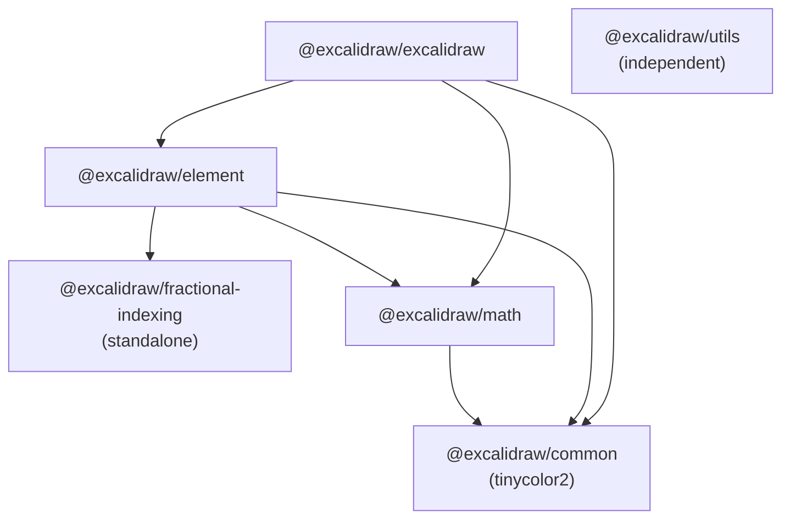
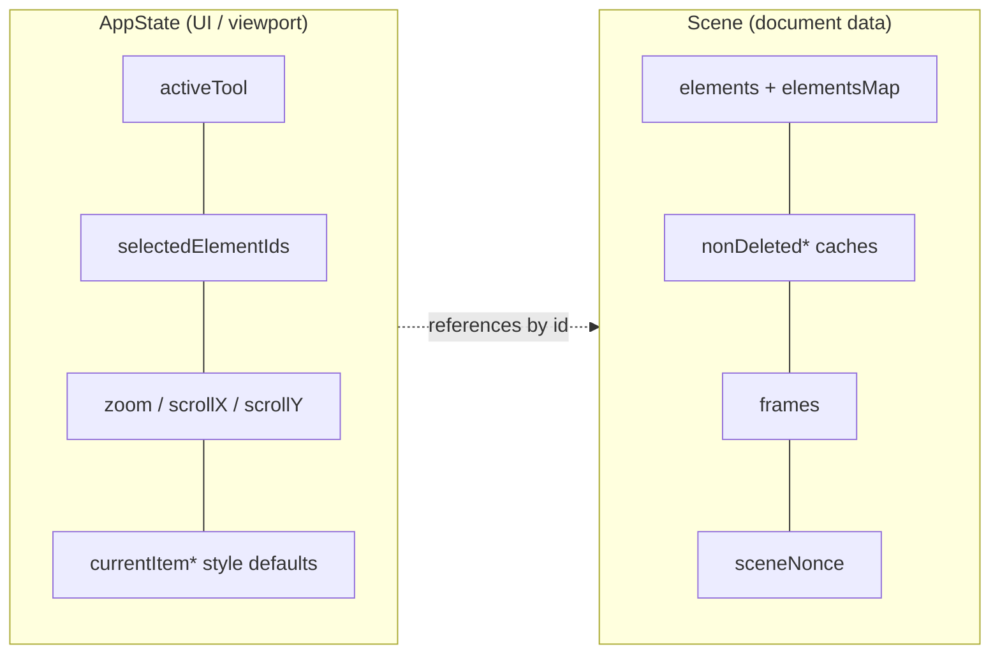
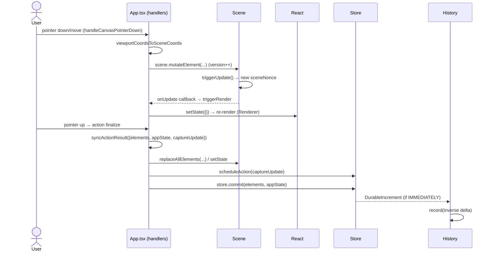
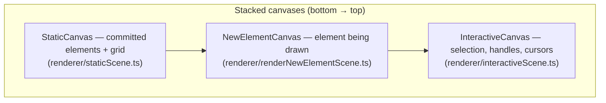
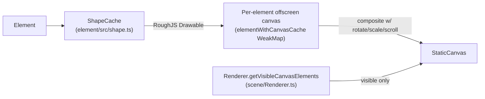

# Excalidraw — Technical Architecture

> Code-verified reconstruction of the architecture for this Excalidraw monorepo snapshot. Every claim below is grounded in the actual source (paths and symbols are cited inline). Companion notes live in [`docs/memory/`](../memory/) (project brief, tech context, system patterns).

**Contents:** [High-level Architecture](#1-high-level-architecture) · [Package Dependencies](#2-package-dependencies) · [State Management](#3-state-management) · [Data Flow](#4-data-flow) · [Rendering Pipeline](#5-rendering-pipeline) · [Cross-cutting Concerns](#6-cross-cutting-concerns)

---

## 1. High-level Architecture

Excalidraw is a **TypeScript monorepo** managed with **Yarn 1 Workspaces** (`package.json` lines 5–8: workspaces `excalidraw-app`, `packages/*`, `examples/*`). It separates a reusable, environment-agnostic **editor library** from a concrete **deployable application**:

- **`excalidraw-app/`** — the standalone web app deployed to excalidraw.com. It is the Vite entry point and a _consumer_ of the editor library. It adds product concerns the library deliberately avoids: Firebase, `socket.io-client` collaboration, Sentry, IndexedDB persistence (`excalidraw-app/package.json`).
- **`packages/excalidraw/`** — `@excalidraw/excalidraw`, the publishable React component that _is_ the editor: canvas, tools, actions, rendering. It declares only `react`/`react-dom` as **peer** dependencies (`packages/excalidraw/package.json`), which is what makes it embeddable in any host app.
- **`packages/{element,math,common,fractional-indexing,utils}/`** — the supporting layers the editor is built from (see §2).

```mermaid
graph TD
  subgraph App["excalidraw-app (deployable)"]
    A[App.tsx + collab + persistence]
  end
  subgraph Lib["@excalidraw/excalidraw (publishable editor)"]
    E[Editor: components, actions, renderer, scene]
  end
  A -->|imports & embeds| E
  E --> EL["@excalidraw/element"]
  E --> M["@excalidraw/math"]
  E --> C["@excalidraw/common"]
  EL --> M
  EL --> C
  EL --> FI["@excalidraw/fractional-indexing"]
  M --> C
  A -. firebase / socket.io / sentry .-> X[(External services)]
```

| Package | Role |
| --- | --- |
| `@excalidraw/common` | Base utilities, constants, colors, keys, points, emitter — no internal deps. |
| `@excalidraw/math` | 2D geometry: points, vectors, curves, ellipses, polygons, collisions. |
| `@excalidraw/fractional-indexing` | Order-key generation for stable, collab-friendly element ordering. |
| `@excalidraw/element` | The element domain model: `Scene`, element types, mutation, binding, the `Store`/delta engine, `ShapeCache`. |
| `@excalidraw/excalidraw` | The React editor component: `App`, actions, renderer, wysiwyg, data import/export. |
| `@excalidraw/utils` | Standalone export/import helpers (independent path; not depended on by the editor). |
| `excalidraw-app` | The deployable app shell: collaboration, persistence, sharing. |

---

## 2. Package Dependencies

### Internal layering

The internal graph is strictly layered. Edges below are taken from each package's `dependencies` field in `packages/*/package.json`:



- `common` — base layer; only external dep is `tinycolor2`.
- `fractional-indexing` — standalone, zero deps.
- `math` → `common`.
- `element` → `common`, `math`, `fractional-indexing`.
- `excalidraw` → `common`, `math`, `element` (+ external deps below).
- `utils` — **independent**; has no internal workspace deps and the editor does not depend on it (it's a separate export/import helper surface).

This layering is confirmed by the build order in `package.json` (the `build:packages` script, lines 55–60): `common → fractional-indexing → math → element → excalidraw`. Each package is built only after everything it depends on.

### Major external runtime dependencies

Grouped by purpose (from `packages/excalidraw/package.json`, and the app's own `excalidraw-app/package.json`):

| Purpose | Libraries |
| --- | --- |
| Hand-drawn rendering | `roughjs`, `perfect-freehand`, `points-on-curve`, `canvas-roundrect-polyfill` |
| Image processing | `pica`, `image-blob-reduce`, `png-chunk(s)-*` |
| State | `jotai`, `jotai-scope` |
| UI | `radix-ui`, `clsx`, `tunnel-rat` |
| Code editor (e.g. mermaid input) | `@codemirror/*`, `@lezer/highlight` |
| Files / compression | `browser-fs-access`, `pako`, `nanoid` |
| Excalidraw add-ons | `@excalidraw/mermaid-to-excalidraw`, `@excalidraw/laser-pointer`, `@excalidraw/random-username` |
| App-only (in `excalidraw-app`) | `firebase`, `socket.io-client`, `@sentry/browser`, `idb-keyval` |

---

## 3. State Management

Excalidraw splits state into **two clearly separated domains**, plus a delta-based durability engine that powers undo/redo and collaboration.

### 3.1 Two state domains

- **`AppState`** — all UI/interaction/viewport state: active tool, selection ids, zoom, scroll, theme, "current item" style defaults, open dialogs/menus, and transient flags (`isResizing`, `isRotating`, …). Defined in `packages/excalidraw/types.ts` (the `AppState` interface, ~line 274); defaults produced by `getDefaultAppState()` in `packages/excalidraw/appState.ts` (~line 22). Crucially, **AppState references elements only by id** (e.g. `selectedElementIds`), never by embedding the elements themselves.
- **Scene elements** — the actual document: the geometric/visual element records.



### 3.2 The `Scene` (not a bare array)

Elements live in a `Scene` **class**, not a plain array (`packages/element/src/Scene.ts`, class at ~line 108). It maintains several synchronized views for fast access and cache invalidation:

- `elements` (incl. deleted) and `elementsMap` (`Map<id, element>`),
- `nonDeletedElements` / `nonDeletedElementsMap` caches,
- `frames` / `nonDeletedFramesLikes`,
- a `selectedElementsCache`,
- `sceneNonce` — a random integer regenerated on every update, used purely as a **renderer cache-invalidation nonce** (see the comment at `Scene.ts` ~line 135).

Key methods: `replaceAllElements()` (atomic full swap + recompute + notify), `mapElements()` (maps, only replacing if something changed), `mutateElement()` (in-place mutation that bumps the element version and calls `triggerUpdate()`), `triggerUpdate()` (new `sceneNonce` + fire callbacks), and `onUpdate(callback)` (subscribe — the editor uses this to schedule renders).

### 3.3 The `Store` — durable vs ephemeral changes

`packages/element/src/store.ts` implements the modern delta engine. Every change is tagged with a **`CaptureUpdateAction`** (lines 38–69) describing how it should reach the undo/redo stacks:

| Value | Meaning | Examples |
| --- | --- | --- |
| `IMMEDIATELY` | Captured to undo/redo right away | finishing a shape, paste, most local edits |
| `NEVER` | Never recorded | remote (collab) updates, scene init |
| `EVENTUALLY` | Deferred; folded into the next `IMMEDIATELY` | async multi-step processes |

The `Store` (class at `store.ts` ~line 78) holds a `StoreSnapshot`, schedules macro/micro actions, and on `commit()` computes a diff and emits **increments**:

- `onDurableIncrementEmitter` → emits a `DurableIncrement` (`{ change, delta }`) for `IMMEDIATELY` changes — these are undoable.
- `onStoreIncrementEmitter` → emits `DurableIncrement | EphemeralIncrement` for all non-`EVENTUALLY` changes — the public `onIncrement` API (collab listens here).

Deltas are first-class: `StoreDelta` / `ElementsDelta` / `AppStateDelta` support `calculate`, `inverse`, `applyTo`, and `squash`, which is what makes both undo/redo and conflict-free collaborative merging possible.

### 3.4 History (undo/redo) — built on deltas

`packages/excalidraw/history.ts` is thin: the `History` class holds `undoStack` and `redoStack` of deltas. It subscribes to the store's `onDurableIncrementEmitter` and, on each durable increment, records the **inverse** delta. Undo/redo pop a delta, `applyTo` the current elements/appState, and push the inverse onto the opposite stack. Its `HistoryDelta.applyTo` excludes `version`/`versionNonce` so each undo/redo produces a _fresh_ version — important for collaboration.

### 3.5 Jotai — isolated, UI-only atoms

`packages/excalidraw/editor-jotai.ts` builds an **isolated** Jotai store via `jotai-scope`'s `createIsolation()` (so multiple editor instances on one page don't share atoms). It is used **only for transient editor UI** (popups, search focus, etc.) — **not** for elements or `AppState`, which flow through the Scene/Store. The app layer has its own store in `excalidraw-app/app-jotai.ts`.

### 3.6 Action system

User-invokable operations are `Action` objects (`packages/excalidraw/actions/`, shape in `actions/types.ts`): a `name`, a `perform(elements, appState, formData, app)` returning `{ elements?, appState?, captureUpdate }`, plus optional `keyTest`, `predicate`, and `PanelComponent`. The `ActionManager` (`packages/excalidraw/actions/manager.tsx`) registers them, runs `keyTest` on keydown, and routes every result through `App.syncActionResult`, which applies elements/appState and schedules the action's `captureUpdate` on the store. This is why toolbar buttons and shortcuts can be generated from action metadata.

---

## 4. Data Flow

The editor core, `packages/excalidraw/components/App.tsx`, is a **React class component** (`class App extends React.Component`, ~line 620). It owns the non-React engine objects directly as instance fields: `this.scene`, `this.store`, `this.history`, `this.actionManager`, and React `this.state` holds the `AppState`.

A typical draw interaction flows like this:



1. **Pointer input** is captured by `App` handlers (e.g. `handleCanvasPointerDown`, ~line 7687) and converted to scene coordinates via `viewportCoordsToSceneCoords`.
2. **Mutation**: the element is updated through `this.scene.mutateElement`, which bumps the element version and calls `scene.triggerUpdate()` (new `sceneNonce`).
3. **Render trigger**: `App` subscribed to the scene via `scene.onUpdate(...)`; the callback schedules a render by calling `setState({})` — an **event-driven** re-render, not a continuous loop.
4. **Commit**: when an action completes, `syncActionResult` applies the result and `store.commit()` computes the delta and emits an increment.
5. **History**: an `IMMEDIATELY` change emits a `DurableIncrement`; `History` records its inverse so it can be undone.
6. **Persistence** (app layer): the resulting elements/appState are serialized to `localStorage`/IndexedDB (`idb-keyval`) and, in collaboration, broadcast via `socket.io`/Firebase — remote changes come back in as `NEVER`-captured updates.

---

## 5. Rendering Pipeline

### 5.1 Three layered canvases

Excalidraw composites **three stacked `<canvas>` layers** (assembled in `App`'s `render`), each with a distinct concern:



Splitting committed content (rarely changes) from interactive overlays (change on every pointer move) keeps redraws cheap.

### 5.2 Scheduling — event-driven + RAF throttling

Rendering is **not** a game loop. State changes drive it via React (`componentDidUpdate`, and `useEffect` in the canvas components). The static layer is throttled to one paint per animation frame through `throttleRAF` (`packages/common/src/utils.ts` ~line 155), exposed as `renderStaticSceneThrottled` from `renderer/staticScene.ts`.

### 5.3 What actually gets drawn — element → cache → canvas



- **Viewport culling**: `Renderer.getVisibleCanvasElements` (`packages/excalidraw/scene/Renderer.ts` ~line 47) keeps only elements passing `isElementInViewport` (`packages/element/src/sizeHelpers.ts` ~line 49). The renderable set is memoized via a `canvasNonce` (which folds in the `sceneNonce`).
- **Hand-drawn look (RoughJS)**: `ShapeCache` (`packages/element/src/shape.ts` ~line 81) caches the generated RoughJS `Drawable`s keyed by element identity; `generateRoughOptions` derives rough options (seed, roughness, fill style…) from element properties. The same path now covers all built-in generic shapes, including `rectangle`, `diamond`, `ellipse`, and `triangle`, so live canvas rendering and export stay in sync.
- **Per-element offscreen canvas cache**: `packages/element/src/renderElement.ts` keeps an `elementWithCanvasCache` WeakMap so each element is rasterized once and re-used. It is invalidated when zoom, theme, element version, image crop, or containing frame opacity changes. Cached canvases are then composited onto the static layer with the element's rotation, scale, and the current scroll offset.
- **Transforms**: every layer applies `appState.zoom.value` and `appState.scrollX/scrollY` uniformly, so all three canvases stay aligned.

### 5.4 Export reuses the same renderers

PNG/SVG export (`packages/excalidraw/scene/export.ts` — `exportToCanvas`, `renderSceneToSvg`) runs the _same_ element renderers with an `isExporting` flag, which bypasses the live caches to guarantee a clean, full-fidelity render.

---

## 6. Cross-cutting Concerns

- **Collaboration** is delta-driven: `@excalidraw/fractional-indexing` gives stable ordering keys, the `Store`'s `ElementsDelta`/`AppStateDelta` make changes mergeable, and remote updates are applied with `CaptureUpdateAction.NEVER` so they don't pollute the local undo stack. Transport (`socket.io`, Firebase) lives in `excalidraw-app/`.
- **Persistence**: the app layer serializes scene + appState to `localStorage` and IndexedDB (`idb-keyval`); the library stays storage-agnostic.
- **i18n**: locale files under `packages/excalidraw/locales/`, surfaced through the library's `i18n` export.

For higher-level narrative and conventions, see the memory bank: [`projectbrief.md`](../memory/projectbrief.md), [`techContext.md`](../memory/techContext.md), [`systemPatterns.md`](../memory/systemPatterns.md).
